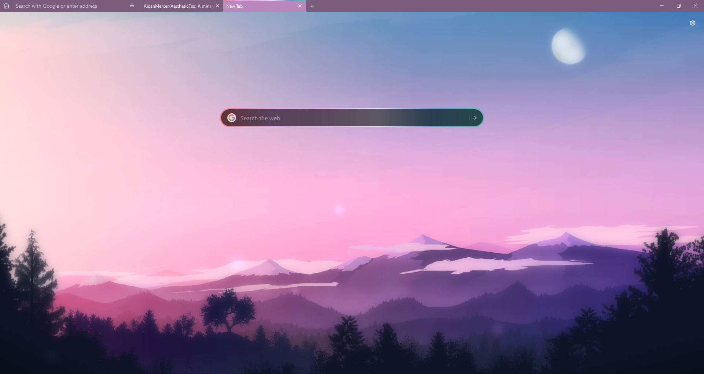

# AestheticFox
A minamist and aesthetic userstyle theme for Firefox.




## Installation

- In the ```about:config``` page on your Firefox browser, set the following parameters to **True** :
  - ```toolkit.legacyUserProfileCustomizations.stylesheets```
- Replace the **chrome** folder with the one from this repository. You can find the **chrome** folder here :
  - On Linux : ```$HOME/.mozilla/firefox/######.default-release/chrome/```
  - On Windows : ```C:\Users\[USERNAME]\AppData\Roaming\Mozilla\Firefox\Profiles\######.default-release\chrome\```
  - On MacOS : ```Users/[USERNAME]/Library/Application Support/Firefox/Profiles/######.default-release/chrome```
  - If it doesn't exist already create a folder called chrome

## Author:
- Aidan Mercer

## Contact:
if you have any questions or concerns, please feel free to contact me at:
- Aidanmercer@gmail.com
- aidan#5213
or ask a question in the 🙏Q&A in Discussions.
